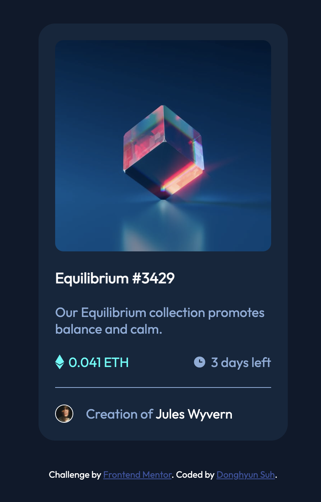

# Frontend Mentor - NFT preview card component solution

This is a solution to the [NFT preview card component challenge on Frontend Mentor](https://www.frontendmentor.io/challenges/nft-preview-card-component-SbdUL_w0U).

### The challenge

Users should be able to:

- View the optimal layout depending on their device's screen size
- See hover states for interactive elements

### Screenshot

### Links

- Solution URL: [Add solution URL here](https://github.com/suhdanny/frontend-mentor/tree/main/nft-preview-card-component-main)
- Live Site URL: [Add live site URL here](https://moonlit-alfajores-5fc00b.netlify.app/)
